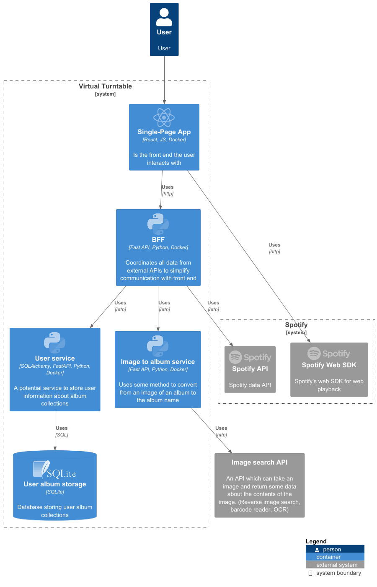

# Virtual Turn Table
## Description
This is a monorepo containing all the code for my UOM BSc Computer Science third year project.
The project is a virtual turn table that allows users to scan they vinyl records and play them in a browser.
The UI is built to work in a desktop environment but will hopefully be changed to work on mobile devices.

## Architecture
The project follows a back end for frontend structure with a React front end and three microservices each made with FastAPI in python.

## Installation
### Development
#### Environment
TO BE ADDED
#### Python
1. Install python 3.11+
2. Initialize a virtual environment
3. Install the requirements with `pip install -r requirements.txt`
4. Run each of the microservices using `fastapi dev <service_name> --reload --port <port>`

#### React
1. Install node.js 18.0+
2. Install the dependencies with `npm install`
3. Run the development server with `npm start`

### Production
1. Install docker and docker-compose
2. Setup environment (TO BE ADDED)
3. Run `docker-compose up --build`
